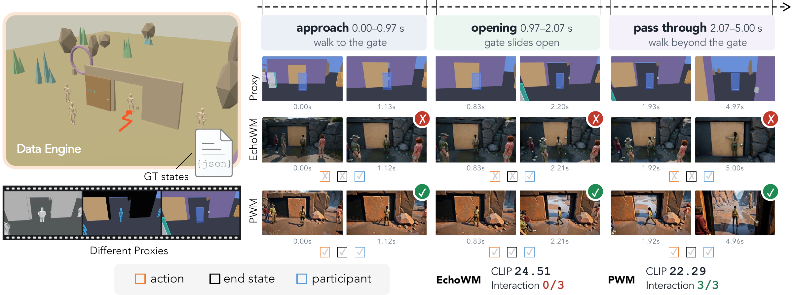

<h1 align="center">Do Video Models Render What the Program Specifies?</h1>

<a href="https://alayalab.ai/"><b>Alaya Lab</b></a>

  Zheng-Hui Huang*, Guixu Lin*, Yu-Ju Tsai, Jian-Kai Zhu, Fengbo Lan, 
  Yu-Lun Liu, Yung-Yu Chuang, Kaipeng Zhang†, Zhixiang Wang† 
  * Equal contribution · † Correspondence

  
  

  

  <i>Visual similarity alone cannot tell whether the program-specified action and end state actually occur.</i>

> A benchmark for programmable world models: 170 programmatically constructed episodes and 600 proxy videos, each logged as a replayable world record of entity states and timestamped events, so generated videos can be checked against the observable consequences of program execution.

Programmable world models separate executable dynamics from visual generation, but their visual adherence to explicit rules and interactions remains insufficiently evaluated. PROWBench renders synchronized views and proxy representations (e.g., coarse 3D, bounding boxes) from engine-recorded world records across first- and third-person perspectives, and evaluates entity control, long-horizon memory, and — with two VLM-based metrics, Logic-Render Alignment and Interaction Success Rate — whether timestamped events are visually realized on the prescribed timeline.

## 📰 News

- **[2026-10-02]** [Project page](https://alaya-lab.github.io/PROWBench/) released.

## 🚀 Release Roadmap

- [x] Project page
- [x] Paper — [PDF](https://alaya-lab.github.io/PROWBench/assets/PROWBench.pdf)
- [ ] Benchmark data
- [ ] Evaluation code

## Citation

Coming soon.
